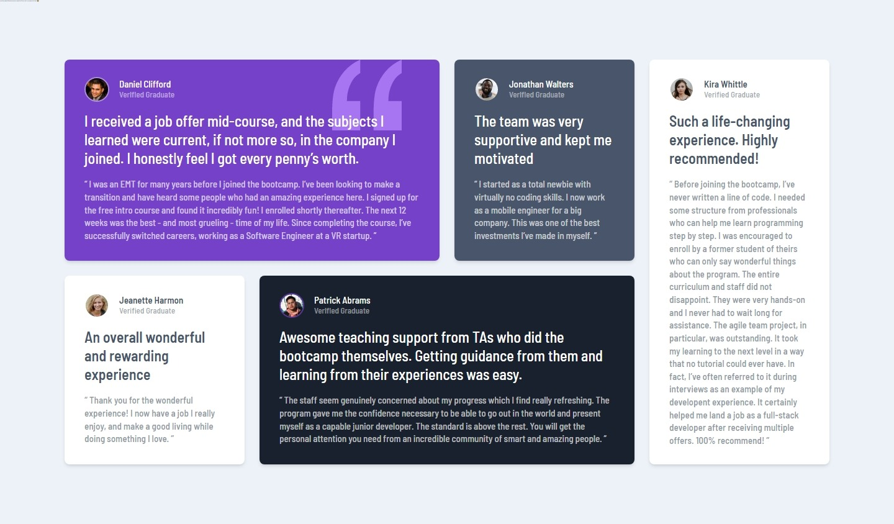

# Frontend Mentor - Testimonials grid section solution

This is a solution to the [Testimonials grid section challenge on Frontend Mentor](https://www.frontendmentor.io/challenges/testimonials-grid-section-Nnw6J7Un7).

## Table of contents

- [Overview](#overview)
  - [The challenge](#the-challenge)
  - [Screenshot](#screenshot)
  - [Links](#links)
- [My process](#my-process)
  - [Built with](#built-with)
- [Author](#author)

## Overview

### The challenge

Users should be able to:

- View the optimal layout for the app depending on their device's screen size

### Screenshot

### Links

- Solution URL: [See solution here](https://www.frontendmentor.io/solutions/todo-app-localstorage-lightdark-mode-sveltekit-ts-and-tailwindcss-nL6zrqo54K)
- Live Site URL: [See live site here](https://testimonials-gris-section.vercel.app/)

## My process

### Built with

- Semantic HTML5 markup
- Grid
- Flexbox
- [TailwindCss](https://tailwindcss.com/) - Utility-first CSS framework

## Author

- Frontend Mentor - [@AntoineC-dev](https://www.frontendmentor.io/profile/AntoineC-dev)
